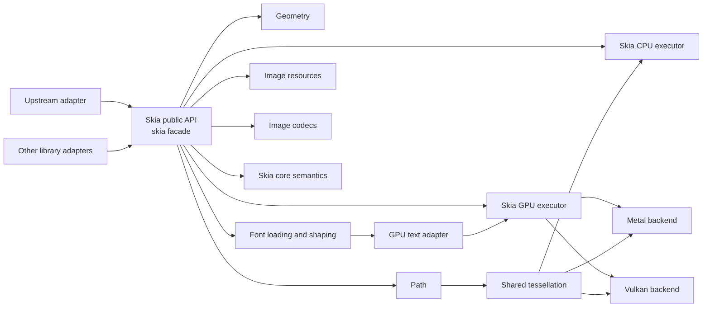

# Skia subsystem boundary

`skia-rs/` is the Rust workspace for an independently developed 2D graphics subsystem and reusable
library. It owns portable geometry, paths, paints, image resources and codecs,
text-glyph drawing contracts, display lists, and CPU/GPU execution. It is **not** an
implementation detail of a particular caller and it does not model caller-specific
operators or objects.

Cargo remains the dependency and package source of truth. The repository also
contains an initial Bazel build rooted at `MODULE.bazel`: `rules_rs` reads
`skia-rs/Cargo.toml` and `skia-rs/Cargo.lock`, while each crate has a small
`BUILD.bazel` target for library and test ownership. Use `bazel build //skia-rs/...`,
`bazel test //skia-rs/...`, or `bazel build --config=clippy //skia-rs/...`.
The existing Cargo workflow remains authoritative while Bazel coverage is being
introduced and validated on every supported platform. Native Windows Bazel builds
require the MSVC C++ build tools used by `rules_rust`; set `BAZEL_SH` to Git Bash
when analyzing or running Rust test targets.

## Platform support

Common library targets have no Bazel operating-system constraint and build on
Windows, Linux, and macOS. Backend targets describe only their real native
availability; there is no separate `portable` platform, crate, or feature.

| Capability | Windows | Linux | macOS |
| --- | --- | --- | --- |
| Facade, CPU, text, codecs, and shared GPU contracts | Yes | Yes | Yes |
| Vulkan backend | Yes | Yes | No |
| Metal backend | No | No | Yes |

Vulkan on macOS is not part of the supported matrix until MoltenVK loading,
packaging, and CI coverage are explicitly provided. Cargo selects backend crates
at the application composition boundary; Bazel expresses the same boundary with
`target_compatible_with` on the Metal and Vulkan targets.

## Dependency rule

- `skia-rs/` (`skia`) is the stable portable drawing facade for ordinary rendering code.
  `skia-rs/error`, `skia-rs/geometry`, `skia-rs/path`, `skia-rs/tessellation`, `skia-rs/text`,
  `skia-rs/core`, `skia-rs/image`, and `skia-rs/codec` are implementation crates; ordinary
  consumers must not depend on them directly. Skia crates may depend on each other, but never
  on a caller-specific document crate or semantic type.
- The application composition root may additionally depend on `skia-rs/gpu`,
  `skia-rs/gpu/text`, and one selected platform executor such as `skia-rs/gpu/metal` or
  `skia-rs/gpu/vulkan`. These crates form the public renderer-integration SPI: they own device
  setup, resource lifetime, backend selection, and submission, but are not the drawing API used
  by ordinary domain or rendering code.
- The facade exports an explicit, stable set of canvas, geometry, paint, path,
  image, text-outline, and error types, together with the default CPU `Canvas` and `Surface`.
  It does not expose display-list resource IDs, GPU command representations, platform devices,
  or backend command encoders.
- `skia-rs/error` contains shared failure types; `skia-rs/geometry` contains fixed
  point coordinates and affine transforms; `skia-rs/path` contains immutable
  paths and path construction. Their dependencies flow only downward.
- `skia-rs/core` contains paint and backend-neutral display-list semantics. It
  depends on the foundational crates but never on an executor, platform
  graphics API, caller-specific parser, document model, or Scene. Its default
  `text` feature adds glyph-run display-list resources; GPU crates disable that
  feature because generic atlas submission does not need shaping types.
- `skia-rs/tessellation` owns backend-neutral path-to-polyline and path-to-mesh
  algorithms. Its bounded fixed-step curve flattener is shared by CPU and
  hardware backends; backend crates own only their raster or GPU buffer format.
- `skia-rs/gpu` owns only generic GPU resources, atlas quads, commands, surface
  formats, device capabilities, limits, and backend submission. `skia-rs/gpu/text`
  is the one-way adapter from font/layout data to GPU atlases and glyph quads;
  portable outline and decoration geometry remains in `skia-core`. Hardware
  backends depend on `skia-gpu`, never on the text adapter, so adding Vulkan or
  WebGPU does not duplicate shaping or atlas policy.
- `skia-rs/gpu/metal` and `skia-rs/gpu/vulkan` are platform execution adapters. The
  Vulkan adapter dynamically loads the platform loader and owns a real instance,
  device, graphics queue, compute pipeline, and offscreen RGBA8 storage target.
  It executes the complete portable command vocabulary in Vulkan shaders,
  preserves target contents across submissions, expands path/stroke geometry on
  the host, and reads pixels back from device-owned memory. The CPU renderer is
  used only as a test oracle and is not a production dependency of this adapter.
- `skia-rs/text/system` is the platform filesystem adapter for system/user font
  discovery, generic-family resolution, and language-preferred family policy.
  It returns stable path/index identities and reloadable records; `skia-rs/text`
  remains independent of operating-system directories and font handles.
- `skia-rs/image` owns the immutable RGBA8 resource representation. `skia-rs/codec`
  parses untrusted, general-purpose image bytes into that representation and
  encodes those resources as general-purpose image formats. It does not depend
  on rendering backends or caller-specific types, so both decode and encode
  remain in `skia-rs/codec`, not in the resource crate.
- Ordinary rendering code calls Skia only through the `skia` facade. Each consumer owns its
  source-domain adapter and reports rendering intent, target description, and source data to its
  composition root. That integration layer may use the renderer SPI directly and owns resource
  lifetime and executor selection before calling lower Skia components.
- A Skia public type, method, error, or command must not mention caller-specific
  objects, operators, page state, or policy. Perform such translation in the
  caller's adapter.

## Text implementation boundary

`skia-rs/text` owns portable font identities, ordered in-memory font collections,
shaped glyph runs, source UTF-8 clusters, bidi visual runs, and validated
vector outlines. These remain one cohesive crate: its root only assembles and
re-exports the public API, while internal modules separate foundational glyph
types, outline contracts, font processing, collections, and layout. This is a
source-organization boundary, not a new dependency or runtime boundary.
`FontFace` owns TrueType/OpenType data and provides
segment-level shaping plus outline resolution. A face also exposes its preferred
OpenType family name, normalized weight/width/slant, and variable-font axes.
Validated Q16.16 axis coordinates create immutable instances with distinct
`FontId` values, and consistently affect shaping, metrics, and outlines.
Immutable feature instances also apply global OpenType values such as `kern=0`
through every single-run, fallback, bidi, and multiline shaping path.
BCP 47-style language tags can likewise be supplied to face, paragraph,
styled, and multiline APIs so language-sensitive OpenType substitutions such
as `locl` remain consistent through fallback, bidi segmentation, wrapping,
hyphenation, and ellipses.
`FontCollection` provides deterministic CSS-like family/style matching,
performs grapheme-level ordered fallback, and shapes unwrapped or greedily
wrapped bidi text into positioned visual runs. Styled spans can select a
preferred immutable face instance and Q16.16 size per grapheme-safe source
range across line boundaries, while retaining fallback and bidi behavior.
They also preserve a renderer-neutral `TextStyleId` and optional decoration
override, allowing CPU and GPU adapters to resolve per-span paints without a
dependency from text layout back to paint semantics.
Every wrap candidate is reshaped independently, and empty hard-break lines use
the logical line-start style's metrics. Layout work remains explicitly bounded.
CPU drawing reuses the ordinary path-fill pipeline. Laid-out lines carry
physical left/center/right alignment or bidi-aware logical start/end alignment.
Justified lines preserve shaping output
and add deterministic per-glyph spacing at interior breakable Unicode spaces,
including ideographic space while excluding non-breaking spaces. If no such
space exists, automatic mixed CJK/script boundaries or an explicit
cross-script inter-character policy distribute width without splitting marks,
ligatures, whitespace, controls, or punctuation.
Callers can also add signed Q16.16 letter spacing between shaping clusters and
word spacing after breakable Unicode spaces; wrapping, ellipses, hit testing,
and carets all use the resulting width without splitting grapheme or shaping clusters.
Callers can use the cached `BuiltinTextBreakProvider`, backed by embedded
Knuth-Liang dictionaries, or plug custom language dictionaries into
`TextBreakProvider`; the layout engine validates UTF-8 grapheme boundaries and
supports either glyph-free soft breaks or synthetic visible hyphens without consuming source bytes. Layout options
can also request underline and strike-through lines globally or per span, with
independently inherited solid, dashed, dotted, or wavy visual patterns.
Their scaled position and thickness come from the selected span's preferred
OpenType face; final visual segments track alignment and justification and stay
continuous across compatible fallback runs. A backend-neutral fixed-point
geometry builder expands every pattern into bounded rectangle strips, which
CPU layout drawing resolves with each segment's style paint after glyph outlines.
Display-list paragraph and layout helpers transactionally expand the same
positioned runs and decoration strips into portable commands, rolling back the
whole expansion if paint resolution, coordinates, or resource budgets fail.
`TextLayout` also maps layout-local points to editable UTF-8 boundaries and
resolves source positions back to vertical carets. Font-provided OpenType GDEF
ligature caret coordinates add internal stops without dividing shaping output.
Upstream/downstream affinity
distinguishes soft-wrap and bidi boundary positions; alignment, justification,
synthetic hyphens, empty lines, and mixed line metrics are included.
Caret-boundary source ranges resolve to line-local `TextSelectionRect`
geometry, including partial ligature components when GDEF data is available.
Wrapped ranges split by line, bidi ranges split by visual
discontinuity, and synthetic markers remain excluded.
Line limits default to an all-or-error resource policy. Callers can explicitly
select clipped output or a grapheme-safe, reshaped final-line ellipsis.
Ellipses retain styled font size and bidi placement, prefer U+2026, and fall
back to three periods without consuming source bytes.

System-font discovery, generic-family mapping, and language-preferred family
selection are available through the separate `skia-system-fonts` adapter;
variable-font instance policy and broader paragraph formatting remain upper
text-layout responsibilities. Portable `layout_outline_batches` and
`layout_decoration_batches` conversion lives in `skia-core`, producing ordinary
target-space paths and rectangles for any renderer. Its ordered
`text_layout_events` traversal is shared by CPU and DisplayList, while the GPU
atlas adapter uses the glyph-only traversal so decoration work cannot affect
atlas construction. GPU atlas text adaptation is available through the separate
`skia-gpu-text` adapter. For bitmap text,
`TextAtlasBuilder` rasterizes and packs a `TextLayout`, and `TextAtlas` converts
layout positions into owned generic quads without borrowing an encoder. The
caller then explicitly registers `into_gpu_atlas()` and records the quads with
`skia-gpu`. This keeps portable text geometry and GPU resource adaptation
separate from command ordering and hardware backends. The Metal
backend draws transformed/scissored solid rectangles, path-fill masks, Alpha8 masks, and color
glyphs through real shader pipelines; rectangle and glyph draws can sample
parent-linked R8 complex-clip masks rendered on the GPU. Destination snapshots
and programmable compositing cover every backend-neutral blend mode.
Local-space linear/radial gradients and pre-composite color filters use the
same paint uniforms across solid, path, stroke, and mask-glyph draws. Real
RGBA8 layer textures retain isolated command ranges; restore can run a color
filter or two-pass separable box blur before applying saved bounds, opacity,
blend mode, and complex clip. `StrokePath` shares deterministic
normalization, dashing, and cap/join policy with CPU; Metal rasterizes its
fixed-resolution triangle list to R8 before the final blend and clip.
`TextAtlasCache` retains
bounded immutable packed atlases with least-recently-used eviction, while stable
generic atlas keys let Metal retain and reuse a separately bounded native
texture across submissions. Both layers expose hit, upload, and eviction stats;
font identities and requested raster sizes remain the caller's invalidation
boundary.

## Geometry and transforms

Paths are immutable geometry resources. `PathBuilder` constructs paths from
generic 2D primitives; it must not encode caller-specific path or graphics-state rules.
Canvas and display-list transforms are generic affine drawing state that apply
to subsequent drawing operations. A consumer
that has a source-specific matrix is responsible for mapping it at its adapter
boundary.

Current primitive construction includes rectangles, circles, ellipses, rounded
rectangles, polygons, deterministic cardinal arcs, arbitrary-angle and rotated
ellipse arcs up to one full turn,
quadratic and rational-quadratic Béziers, and cubic Béziers. Paths can be
transformed, appended, reversed, and queried for both conservative
control-point bounds and curve-extrema-aware conservative bounds (with rational
quadratics retaining their control hull). `DisplayList` and the GPU encoder
expose both transform replacement and affine concatenation as generic
graphics-state operations. Backend-neutral `StrokeOptions` defines
center/inside/outside alignment, butt/round/square caps, miter/round/bevel
joins, miter limits, and canonical dash patterns. Non-center alignment is
defined only for closed, non-degenerate contours and follows contour winding.
CPU Canvas, Metal, and Vulkan consume the same expanded triangle mesh; DisplayList and
generic GPU commands preserve the options, and software replay introduces no
backend-specific stroke policy.
Backend-neutral `SamplingOptions` similarly preserves nearest or bilinear
clamp-to-edge image reconstruction through DisplayList and GPU commands. CPU
uses checked affine inverse mapping and deterministic integer bilinear
interpolation; Metal applies the same texel-center convention to arbitrary
affine image draws.
Backend-neutral paint also carries bounded local-space linear/radial gradients,
Q16.16 color matrices and color filters. `SaveLayerOptions` records isolated
restore bounds, opacity, blend mode, and an optional color or box-blur image
filter. CPU Canvas and software GPU replay execute these semantics directly;
DisplayList and generic GPU commands retain the same layer boundaries and
image-paint state for hardware backends.
Backend-neutral `ClipOp` defines intersection and difference. CPU Canvas,
DisplayList replay, and the generic GPU encoder apply it to rectangles or paths.
Axis-aligned rectangle intersections retain a scissor fast path; CPU complex
clips use deterministic masks, while generic GPU commands retain immutable
parent-linked `GpuClipId` nodes. The software reference backend replays those
nodes through CPU masks, and Metal materializes only used nodes as transient R8
textures shared by subsequent rectangle, path-fill, and glyph draws in the submission.
CPU fill/stroke/clip plus Metal and Vulkan clip-edge generation consume the same bounded,
deterministic fixed-step curve flattener from `skia-tessellation`. Stroke
normalization, dashing, and cap/join/miter coverage also live there; CPU keeps
only device-pixel bounds and raster iteration, while backend-specific mask and
edge formats remain local.
`path_boolean` exposes bounded union, intersection, difference, and XOR over
flattened Q16.16 contours, including holes and self-intersections; empty set
results are represented as `None`, while non-empty output uses non-zero fill.
`trim_path`, `corner_path`, `discrete_path`, and `dash_path` provide bounded path
effects for normalized arc-length trimming, deterministic quadratic corner
rounding, seeded fixed-point contour perturbation, and dashed centerlines. Trim
supports wrap-around intervals; corner radii are clamped to half of each
adjacent edge; discrete resampling keeps open endpoints and closed seams stable.
All implement the extensible `PathEffect` contract and can run left-to-right
through `compose_path_effects` or nest through `ComposePathEffect`; parallel
results can be concatenated with `SumPathEffect`. Input transforms are never
reapplied between stages.
`stroke_to_path` is also available through the facade and produces a
deterministic non-zero triangle-fill path.

## Path implementation layout

The public `Path` and `PathBuilder` API is implemented in `skia-rs/path/src/path.rs` and
re-exported by the crate's thin `lib.rs` entry point.
Algorithm families are split beneath it so construction contracts do not become
coupled to geometry queries or contour processing:

- `path/arc.rs` owns public ellipse-arc construction and continuation methods.
- `path/bounds.rs` owns conservative and polynomial-Bézier extrema bounds helpers.
- `path/reverse.rs` owns contour parsing and reverse traversal.
- `path/math.rs` owns checked fixed-point scalar operations shared by path code.

Backend consumers must not add their own Bézier flattening. The reusable
`PathFlattener`, output ceilings, and flattened contour representation live in
`skia-rs/tessellation/src/flatten.rs`, ready for Metal, Vulkan, WebGPU, and CPU
consumers without exposing backend command or buffer types.

## GPU implementation layout

`skia-rs/gpu` is the public renderer-integration SPI, not the ordinary drawing
facade. Its thin `src/lib.rs` router re-exports contracts grouped by responsibility:

- `backend.rs` owns the backend trait and operational error boundary.
- `surface.rs` owns portable target descriptors and formats.
- `limits.rs` owns command ceilings and device-reported capabilities.
- `resource.rs` owns command-local IDs, atlas resources, glyph quads, and clip nodes.
- `command.rs` owns immutable commands and command buffers.
- `encoder.rs` owns stateful, bounded command recording.
- `software.rs` is the feature-gated conformance oracle, not a hardware backend.

Native handles, descriptor layouts, shaders, queues, and backend caches remain
inside `gpu/metal` or `gpu/vulkan`; they are not part of this SPI.
