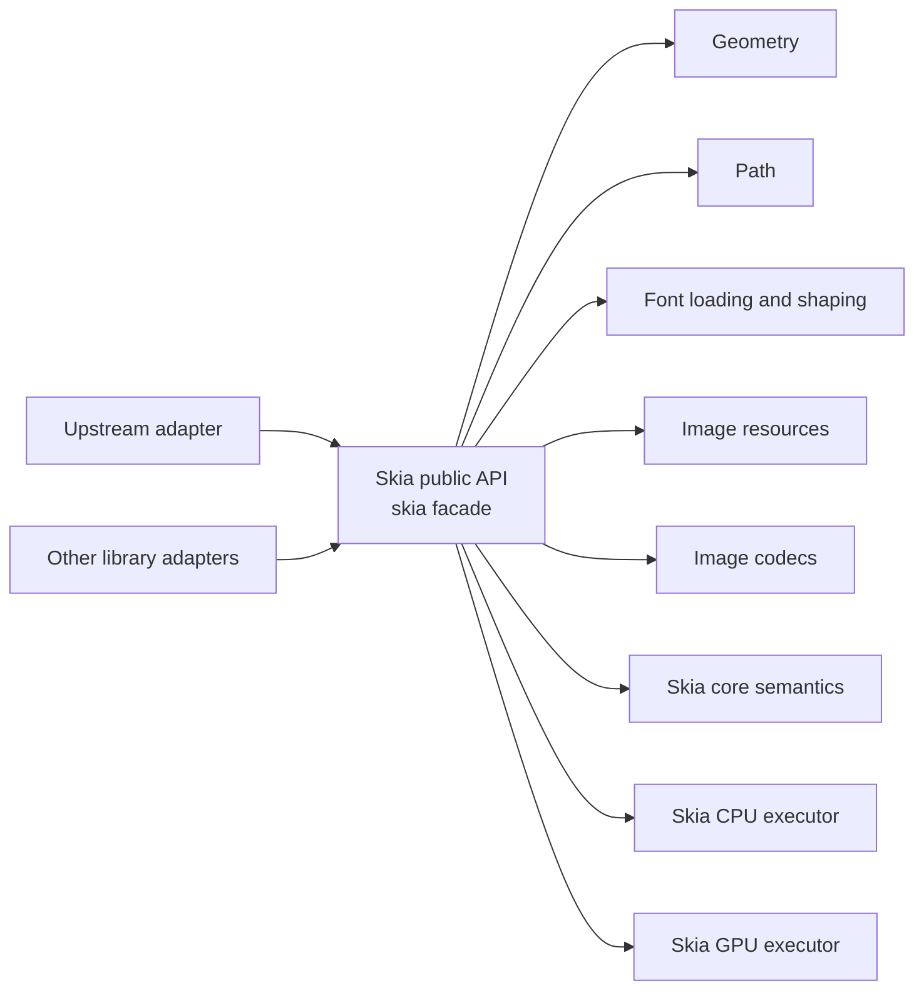

# Skia subsystem boundary

`skia/` is an independently developed 2D graphics subsystem and reusable
library. It owns portable geometry, paths, paints, image resources and codecs,
text-glyph drawing contracts, display lists, and CPU/GPU execution. It is **not** an
implementation detail of a particular caller and it does not model caller-specific
operators or objects.

## Dependency rule

- `skia/` (`skia`) is the only public graphics API for consumers.
  `skia/error`, `skia/geometry`, `skia/path`, `skia/text`, `skia/core`, `skia/image`,
  `skia/codec`, and executor crates are implementation crates;
  consumers must not depend on them directly. Skia crates may depend on each
  other, but never on a caller-specific document crate or semantic type.
- The facade exports an explicit, stable set of canvas, geometry, paint, path,
  image, text-outline, and error types. It does not expose display-list
  resource IDs, command representations, or backend command encoders.
- `skia/error` contains shared failure types; `skia/geometry` contains fixed
  point coordinates and affine transforms; `skia/path` contains immutable
  paths and path construction. Their dependencies flow only downward.
- `skia/core` contains paint and backend-neutral display-list semantics. It
  depends on the foundational crates but never on an executor, platform
  graphics API, caller-specific parser, document model, or Scene.
- `skia/image` owns the immutable RGBA8 resource representation. `skia/codec`
  parses untrusted, general-purpose image bytes into that representation and
  encodes those resources as general-purpose image formats. It does not depend
  on rendering backends or caller-specific types, so both decode and encode
  remain in `skia/codec`, not in the resource crate.
- Every consumer calls Skia only through its public API. Each consumer owns its
  source-domain adapter and reports its rendering
  intent, target description, and source data to the Skia upper integration
  layer. That layer owns resource lifetime and executor selection before
  calling lower Skia components.
- A Skia public type, method, error, or command must not mention caller-specific
  objects, operators, page state, or policy. Perform such translation in the
  caller's adapter.

## Text implementation boundary

`skia/text` owns portable font identities, ordered in-memory font collections,
shaped glyph runs, source UTF-8 clusters, bidi visual runs, and validated
vector outlines. `FontFace` owns TrueType/OpenType data and provides
segment-level shaping plus outline resolution. A face also exposes its preferred
OpenType family name, normalized weight/width/slant, and variable-font axes.
Validated Q16.16 axis coordinates create immutable instances with distinct
`FontId` values, and consistently affect shaping, metrics, and outlines.
Immutable feature instances also apply global OpenType values such as `kern=0`
through every single-run, fallback, bidi, and multiline shaping path.
BCP 47-style language tags can likewise be supplied to face, paragraph,
styled, and multiline APIs so language-sensitive OpenType substitutions such
as `locl` remain consistent through fallback, bidi segmentation, wrapping,
hyphenation, and ellipses.
`FontCollection` provides deterministic CSS-like family/style matching,
performs grapheme-level ordered fallback, and shapes unwrapped or greedily
wrapped bidi text into positioned visual runs. Styled spans can select a
preferred immutable face instance and Q16.16 size per grapheme-safe source
range across line boundaries, while retaining fallback and bidi behavior.
Every wrap candidate is reshaped independently, and empty hard-break lines use
the logical line-start style's metrics. Layout work remains explicitly bounded.
CPU drawing reuses the ordinary path-fill pipeline. Laid-out lines carry
physical left/center/right alignment or bidi-aware logical start/end alignment.
Justified lines preserve shaping output
and add deterministic per-glyph spacing at interior breakable Unicode spaces,
including ideographic space while excluding non-breaking spaces. Callers can
also add signed Q16.16 letter spacing between shaping clusters and word spacing
after breakable Unicode spaces; wrapping, ellipses, hit testing, and carets all
use the resulting width without splitting grapheme or shaping clusters.
Callers can plug language dictionaries into `TextBreakProvider`; the layout engine
validates UTF-8 grapheme boundaries and supports either glyph-free soft breaks
or synthetic visible hyphens without consuming source bytes. Layout options
can also request underline and strike-through lines. Their scaled position and
thickness come from the collection's primary OpenType face for uniform layout,
or from the logical line-start span for styled layout, and stay continuous
across fallback runs; CPU layout drawing paints them after glyph outlines.
`TextLayout` also maps layout-local points to UTF-8 cluster boundaries and
resolves source positions back to vertical carets. Upstream/downstream affinity
distinguishes soft-wrap and bidi boundary positions; alignment, justification,
synthetic hyphens, empty lines, and mixed line metrics are included.
Line limits default to an all-or-error resource policy. Callers can explicitly
select clipped output or a grapheme-safe, reshaped final-line ellipsis.
Ellipses retain styled font size and bidi placement, prefer U+2026, and fall
back to three periods without consuming source bytes.

System-font discovery, generic-family mapping, variable-font instance selection,
language-specific font selection, dictionary data and algorithms, non-ASCII
inter-character justification, per-span paint and decoration styles, and
decorative line variants remain upper text-layout responsibilities. Ligature
internal caret data and selection rectangles are also not exposed. GPU glyph
commands, glyph atlases, hinting, and color-font painting are not implemented
yet.

## Geometry and transforms

Paths are immutable geometry resources. `PathBuilder` constructs paths from
generic 2D primitives; it must not encode caller-specific path or graphics-state rules.
Canvas and display-list transforms are generic affine drawing state that apply
to subsequent drawing operations. A consumer
that has a source-specific matrix is responsible for mapping it at its adapter
boundary.

Current primitive construction includes rectangles, circles, ellipses, rounded
rectangles, polygons, deterministic cardinal arcs, arbitrary-angle and rotated
ellipse arcs up to one full turn,
quadratic and rational-quadratic Béziers, and cubic Béziers. Paths can be
transformed, appended, reversed, and queried for both conservative
control-point bounds and curve-extrema-aware conservative bounds (with rational
quadratics retaining their control hull). `DisplayList` and the GPU encoder
expose both transform replacement and affine concatenation as generic
graphics-state operations. Boolean path operations, stroke-to-path expansion,
path effects, and tangent-/endpoint-defined arc variants remain separate
geometry-processing work; their design must stay independent of any consumer.

## Path implementation layout

The public `Path` and `PathBuilder` API is implemented in `skia/path/src/lib.rs`.
Algorithm families are split beneath it so construction contracts do not become
coupled to geometry queries or contour processing:

- `arc.rs` owns public ellipse-arc construction and continuation methods.
- `bounds.rs` owns conservative and polynomial-Bézier extrema bounds helpers.
- `reverse.rs` owns contour parsing and reverse traversal.
- `math.rs` owns checked fixed-point scalar operations shared by path code.
